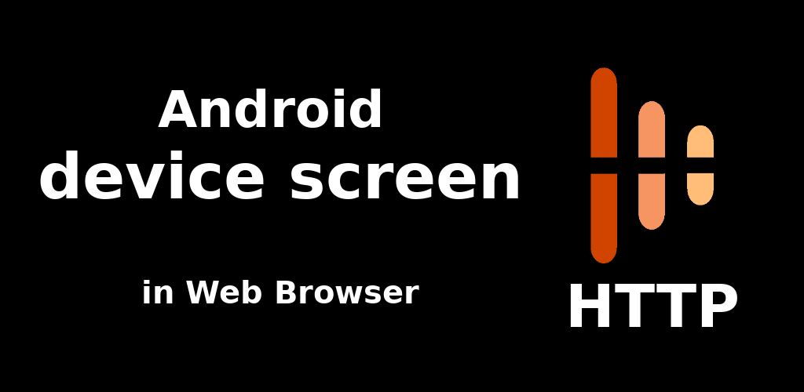

# AIS Screen Stream over HTTP
An Android mobile app for viewing device screen in your web browser.

----

The application allows viewing the Android device screen in your web browser. The main idea is to show your ais dom gate screen in AI-Speaker web application.

> *The app was originally Developed by [Dmitriy Krivoruchko](dkrivoruchko@gmail.com) as a Screen Stream. This repo is a fork of Screen Stream app for AIS needs* &middot;
